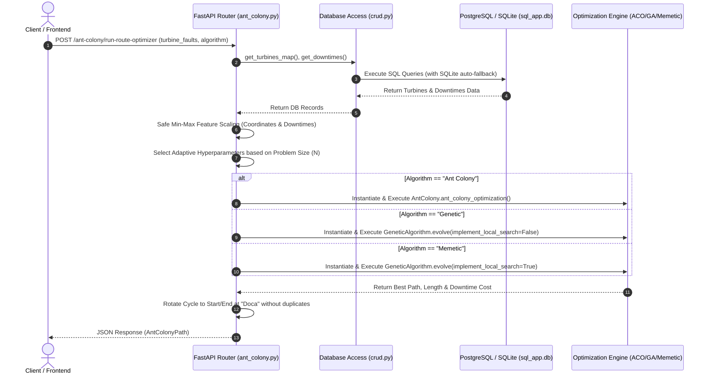

# Project Context & Architecture

This document serves as the primary long-term memory and technical reference for the **Ant Colony & Metaheuristics FastAPI Backend** workspace.

---

## 1. Project Overview

* **Purpose**: A high-performance Python FastAPI backend designed for optimizing offshore wind farm turbine maintenance routing. The service computes optimal maintenance navigation routes using bio-inspired metaheuristic algorithms (Ant Colony Optimization, Genetic Algorithms, and Memetic Algorithms), balancing travel distance against turbine fault downtime costs.
* **Target Audience**: Researchers, wind farm operational planners, and maintenance engineers needing intelligent scheduling and route optimization.
* **Context**: Originally developed as part of an offshore wind farm maintenance research project (TCC), integrating PostgreSQL/SQLite database storage, algorithmic solvers, and a web API supporting frontend dashboards (e.g., React / Vite / Next.js).

---

## 2. Tech Stack

* **Core Language**: Python 3.10+
* **Package & Environment Management**: [uv](https://docs.astral.sh/uv/) (`pyproject.toml`, `uv.lock`), `pip` (`requirements.txt`), `.python-version`
* **Web Framework**: FastAPI, Starlette, Uvicorn (ASGI server)
* **Data Validation & Schemas**: Pydantic (`BaseModel`, `Field`)
* **ORM & Database Connection**: SQLAlchemy (with automatic fallback from PostgreSQL `psycopg2-binary` to local SQLite `sql_app.db`), `python-dotenv`
* **Optimization & Data Science**:
  * `numpy` – Vectorized numerical operations, distance matrices, and heuristic probabilities
  * `pandas` – Data manipulation, CSV processing, and feature scaling
  * `scipy` – Scientific computing utilities
  * `matplotlib` – Path and route visualization plots
* **Testing & Benchmarking**:
  * `pytest` – Comprehensive test suite (heuristics, API endpoints, SQL generation/CRUD)
  * `httpx` / `TestClient` – Endpoint integration testing
  * `asyncio`, `itertools` – Grid search hyperparameter benchmarking
  * Jupyter Notebooks (`ipynb`) – Analytical evaluation and parameter mean calculations

---

## 3. Architecture & Directory Structure

```
ant_colony_fast_api_backend/
├── app/                        # Main application package
│   ├── pages/                  # Router modules (API endpoints grouped by domain)
│   │   ├── ant_colony.py       # Core optimization routes (/ant-colony/run-route-optimizer)
│   │   ├── assets.py           # Financial assets router (legacy/auxiliary)
│   │   └── transactions.py     # Transactions router (legacy/auxiliary)
│   ├── crud.py                 # Data access layer (SQLAlchemy queries & raw SQL)
│   ├── database.py             # Database engine with auto-fallback (PostgreSQL -> SQLite)
│   ├── models.py               # SQLAlchemy ORM model definitions
│   └── schemas.py              # Pydantic schemas for request/response serialization
├── database/                   # Seed CSV datasets and generated database SQL scripts
│   ├── downtime.csv            # Subsystem fault downtime data
│   ├── subsystem.csv           # Subsystem definitions
│   ├── wind_farm_map_points.csv# Geographical turbine map coordinates
│   └── database.sql            # Interchangeable PostgreSQL/SQLite SQL dump script
├── scripts/                    # Core metaheuristic optimization engines
│   ├── ant_colony.py           # Ant Colony Optimization (ACO) algorithm class
│   └── genetic_algorithm.py    # Genetic & Memetic (GA + 2-opt) algorithm class
├── tests/                      # Benchmarking, grid search, and automated test suite
│   ├── inputs/                 # CSV datasets (problem instances: 5 to 100 turbines)
│   ├── output/                 # Grid search and benchmark test results (CSV)
│   ├── ant_colony_tests.py     # ACO parameter testing & grid search runner
│   ├── genetic_algo_tests.py   # GA & Memetic parameter testing runner
│   ├── generate_sql.py         # Utility script to build database.sql from database/ CSVs
│   ├── test_database_sql.py    # Pytest integration tests for SQL generation & CRUD
│   ├── test_api_endpoints.py   # Pytest integration tests for FastAPI endpoints
│   ├── test_heuristics.py      # Pytest unit & integration tests for ACO/GA/Memetic
│   └── *.ipynb                 # Jupyter notebooks for analytical evaluation
├── database.sql                # Root copy of interchangeable database.sql script
├── sql_app.db                  # Local SQLite database instance (auto-seeded)
├── main.py                     # Application entry point & FastAPI middleware configuration
├── pyproject.toml              # Modern project & dependency configuration (uv/PEP 621)
├── uv.lock                     # Locked dependency tree for uv
├── requirements.txt            # Python dependency specification (pip fallback)
├── .python-version             # Python version pin (3.10)
├── .gitignore                  # Git ignore rules for virtual environments, caches, and DBs
└── .env                        # Environment variables (DB user, password, DB name, DB_ENGINE)
```

### Responsibility Breakdown

* **`main.py`**: Initializes the FastAPI app, configures CORS middleware with regex support for `localhost` and `127.0.0.1` on any port (as well as 3000, 5173, 5174, 8000, 8080, 4173), binds database tables, and registers API routers.
* **`app/database.py`**: Builds the SQLAlchemy database engine with automatic fallback:
  - If `DB_ENGINE=sqlite` is specified or PostgreSQL connection fails, it creates a local SQLite database (`sql_app.db`).
  - Automatically seeds `sql_app.db` with schema and seed data from `database/database.sql` if tables do not exist.
* **`app/pages/ant_colony.py`**:
  - Handles `/ant-colony/run-route-optimizer`, `/ant-colony/get-turbines-map`, and `/ant-colony/get-subsystems`.
  - Normalizes coordinates and downtime values with safe `min_max_scale` (protecting against zero division on single/identical turbines).
  - Dynamically selects algorithm hyperparameters based on problem size ($N$ turbines):
    - **Small ($N \le 10$)**: ACO (ants=15, iters=50, $\alpha=1.0, \beta=2.0, \rho=0.5, Q=100$), GA (pop=40, gen=60, mut=0.15), Memetic (pop=30, gen=40, mut=0.1).
    - **Medium ($10 < N \le 40$)**: ACO (ants=30, iters=100), GA (pop=80, gen=150), Memetic (pop=50, gen=100).
    - **Large ($N > 40$)**: ACO (ants=50, iters=200), GA (pop=120, gen=250), Memetic (pop=80, gen=180).
  - Rotates the calculated cycle cleanly to ensure `turbine_order_to_show` starts and ends at `"Doca"` without repeating intermediate nodes.
* **`scripts/ant_colony.py`**:
  - Object-oriented implementation of `AntColony`.
  - Computes transition probability using combined heuristic $\tau_{ij}^\alpha \cdot \eta_{ij}^\beta$ where $\eta_{ij} = \frac{1}{\text{dist}_{ij} + \text{downtime}_j + \epsilon}$.
  - Applies pheromone evaporation ($\rho$) and deposits pheromone proportionally on traversed edges based on overall tour cost ($Q / \text{cost}$).
* **`scripts/genetic_algorithm.py`**:
  - Object-oriented implementation of `GeneticAlgorithm`.
  - Features elitism (preserving top 2 individuals per generation), ordered crossover (OX), and swap mutation.
  - Implements 2-opt local search heuristics for the Memetic variant (`implement_local_search=True`).
* **`app/schemas.py`**: Pydantic models for inputs (`TurbineFaults` with optional `turbine_name`) and outputs (`AntColonyPath` including `best_path_len_downtime` and `time_to_run_sec`).
* **`app/crud.py`**: Encapsulates database queries for fetching turbine coordinates (`wind_farm_map_points`), subsystems, downtimes, assets, and transactions.
* **`tests/test_heuristics.py`**: Comprehensive pytest suite (26 tests) covering ACO pheromone deposition, GA elitism/crossover/mutation, Memetic 2-opt convergence, scaling edge cases, and cycle rotation.
* **`tests/test_api_endpoints.py`**: Pytest integration tests validating all FastAPI endpoints, payload parsing, algorithm switching, single turbine handling, and empty list fallback.
* **`tests/test_database_sql.py`**: Pytest integration tests verifying ANSI SQL generation, SQLite/PostgreSQL execution, and SQLAlchemy CRUD operations.
* **`tests/generate_sql.py`**: Custom script reading CSV files in `database/` and generating portable ANSI SQL scripts (`database/database.sql` and `database.sql`).

---

## 4. Core Workflows



### Key Data Normalization & Objective Functions

1. **Safe Min-Max Feature Normalization**:
   \[
   x_{\text{norm}} = \begin{cases}
   \frac{x - x_{\text{min}}}{x_{\text{max}} - x_{\text{min}}} & \text{if } x_{\text{max}} > x_{\text{min}} \\
   0.0 & \text{otherwise}
   \end{cases}
   \]
   Normalizes latitude, longitude, and fault downtime days to equal scales ($[0, 1]$), avoiding division by zero for single-turbine problems.

2. **Combined Objective Cost Function**:
   \[
   f(\text{path}) = \text{Total Scaled Distance}(\text{path}) + \text{Total Downtime Cost}(\text{path})
   \]

3. **ACO Transition Probability**:
   \[
   p_{ij} = \frac{\tau_{ij}^\alpha \cdot \eta_{ij}^\beta}{\sum_{k \in \text{unvisited}} \tau_{ik}^\alpha \cdot \eta_{ik}^\beta}, \quad \text{where } \eta_{ij} = \frac{1}{\text{dist}_{ij} + \text{downtime}_j + \epsilon}
   \]

---

## 5. Development Guide

### Environment Setup

#### Option A: With `uv` (Fast & Modern)
```bash
# Sync virtual environment and dependencies
uv sync
```

#### Option B: With `pip` & `venv`
```bash
python -m venv .venv
source .venv/bin/activate  # Linux/macOS
# .venv\Scripts\activate   # Windows

pip install -r requirements.txt
```

### Database Configuration

* **Default / Zero-Config**: If `.env` is omitted or PostgreSQL is down, the backend uses local `sql_app.db` seeded from `database/database.sql`.
* **Explicit PostgreSQL**: Set `.env` credentials:
  ```env
  DB_user=postgres
  DB_password=your_password
  DB_name=wind_maintenance
  ```
* **Explicit SQLite**: Set in `.env`:
  ```env
  DB_ENGINE=sqlite
  ```

### Running the Application

```bash
# Using uv
uv run uvicorn main:app --reload --host 0.0.0.0 --port 8000

# Or with activated virtual environment
uvicorn main:app --reload --host 0.0.0.0 --port 8000
```
Access Swagger API documentation at `http://localhost:8000/docs`.

### Running Tests & Benchmarks

```bash
# Run full test suite (26+ tests)
uv run pytest

# Run specific test modules
uv run pytest tests/test_heuristics.py
uv run pytest tests/test_api_endpoints.py
uv run pytest tests/test_database_sql.py

# Re-generate interchangeable database.sql from database/ CSVs
uv run python tests/generate_sql.py

# Run ACO hyperparameter grid search & GA benchmark scripts
uv run python tests/ant_colony_tests.py
uv run python tests/genetic_algo_tests.py
```

---

## 6. Workspace Rules & Design Patterns

1. **Router Separation**: API endpoints are organized modularly in `app/pages/`. New endpoints must be added as independent routers and registered in `main.py`.
2. **Strict Schema Validation**: Request and response objects use Pydantic models in `app/schemas.py`.
3. **Decoupled Optimization Solvers**: Algorithm logic lives strictly in `scripts/` as independent, standard Python classes (`AntColony`, `GeneticAlgorithm`) so they can be executed standalone or imported by FastAPI endpoints.
4. **Dual Database Resilience**: `app/database.py` guarantees high availability by falling back to SQLite if PostgreSQL is inaccessible.
5. **Safe Normalization**: All feature scaling operations must use `min_max_scale` or include explicit checks against $x_{\text{max}} == x_{\text{min}}$ to prevent `NaN` values.
6. **Cycle Consistency**: All returned route paths must form a closed cycle beginning and ending at `"Doca"`.
7. **CORS Configuration**: Allowed origins support modern frontend tooling on ports 3000, 5173, 5174, 8000, 8080, 4173, and regex for localhost.
